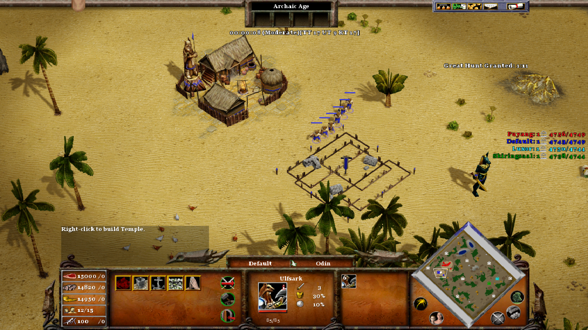

# Lost Continent of Adria

In the mitical continent of Adria, a fantastic and mitical land there is a permanet conflit among all the human and beast races that inhabits that land. 

You will have the mission to lead the Nords, an human rance that lives in the snowi montain and pine forests of the north though a journy to conquer the world. 

You will travel through deserts, forests, montains, vulcans and forests, full of secrets, animals and mythical creatures. 

## Campaign and Gameplay

* In the main campain, will controll the **Nords**. 

* On each quest of the main Campaign you will have to defeat one or two armies of a rival race.

* One you conquer all the territory of a rance, and force all their cities to surrender, this race will be included on your army, and you will be able to control this unity as well. 

* **Unlike** in the Vanilla game, in this quests will **CANNOT** create unities. You, and your enemy will start with all the unities, except by the one grannted as git of the gods when you advance an age. Therefore, you must use each unity wisely. Protect your unities building walls, and use long-range unities to protect close-combat unities. 

* You dont have to kill every single unity of your enemy to defeat its army. Instead you will have to defeat the leader of each city. This unity should be close to the main camp of each city. 

## Lore 

The Lost Continent of Adria have six major regions, each one wich is inhabited by one difference race:

* **Nordic Taiga**: the northern region of the continent, homeland of the Nords.  If full of snowi montains and pine forests. Their capital is hidden in a hill in the middle of the forest.

* **Central Desert**: homeland of the Bedouins, the Central desert is a harsh lend with few trees and wather, but some oasis, and is rich in minerals. The Bedouins capital is the have the stronger fortificatons of the whole continent. 

* **South Savannah**: homeland of the Werejackals, is a vast savannah with plenty of natural resources. Their capital is a farm city close to the sea.

* **Rock Valey**: The most mysterious and seclude land of the continent. It is a misty land sorounded the the western sea, and the fire montains at east. Fogs fills its pine dark forest, and the wildlive is mostly composed by misterious mythical creates. This is the homeland of the Trolls. Each clan leader of each settlement wons a pet, a faithful beast from the wilds.

* **Oak Forest**: An oak forest sorounded in the west by the Rock Montains. It is inhabited by the Cyclops, the stronger race of the continet. They have only on main city close the the sea and the Savannah. 

* **Palm Isthmus**: A small portion of land in the south, inhabited by the Creatans. They are fewer in number, but have the stronger navy army of the continent.

## Random Maps

This mod includes some new random maps as well, not related the the campaign, but each one with an unique mechanic:

* **Arabian Desert**: A large desert with hidden treasures and bandit camps and scarse wood.

* **Elysius Camps**: A miraculous and brilliant land, with plenty of resources available, but you will have to fight for it.

* **Guardians A**: Each player starts with a Guardian in the Valley of the Kings.

* **Guardians B**: Each player starts with a Guardian in a Savanna megalopolis.

* **One Settlement**: All players start with one settlement and some small villages. But there are no other settlements available.

* **Ragnarock**: A Battle Royale among the gods in a nordic apocalyptic World.

* **Sahara Desert**: All resources are hard to be found in this map, especially wood.

