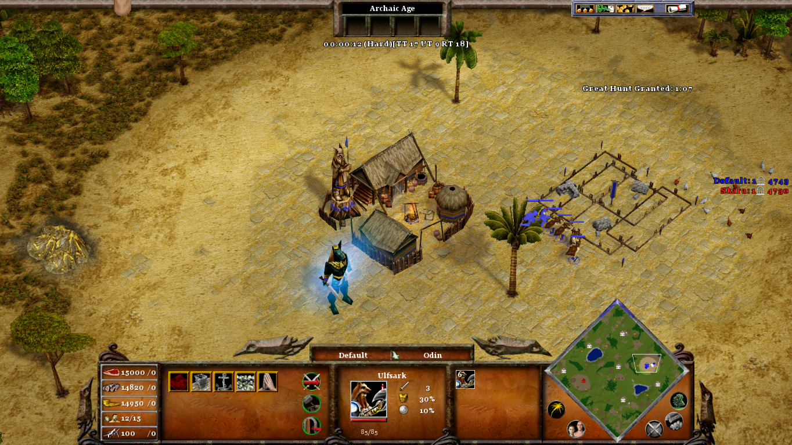
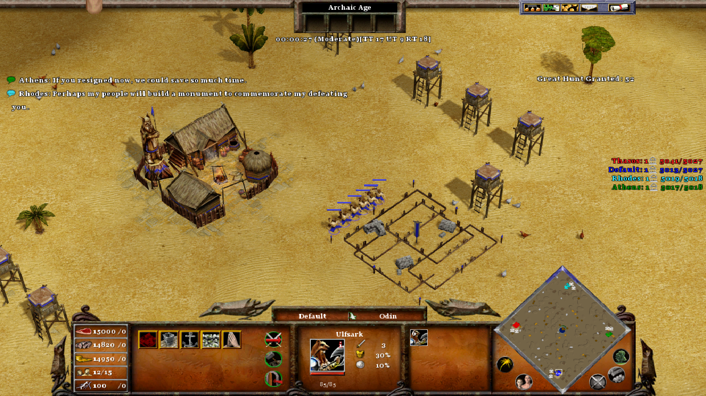
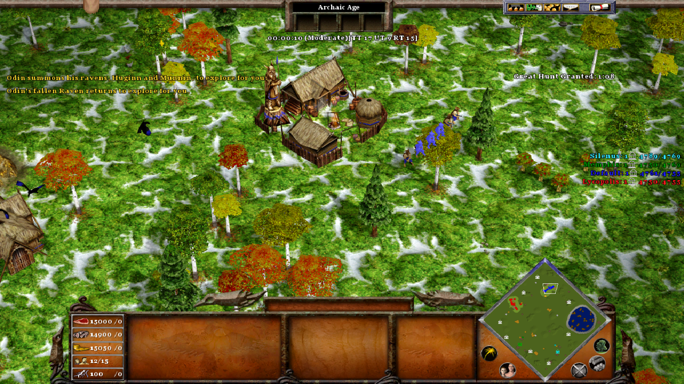
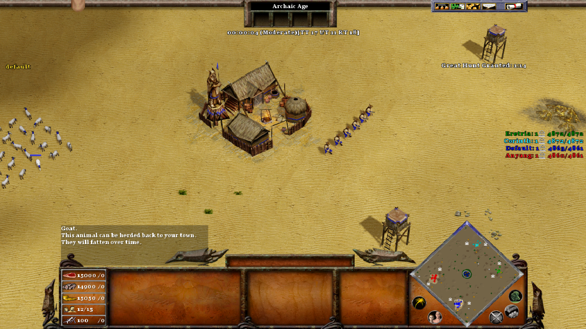
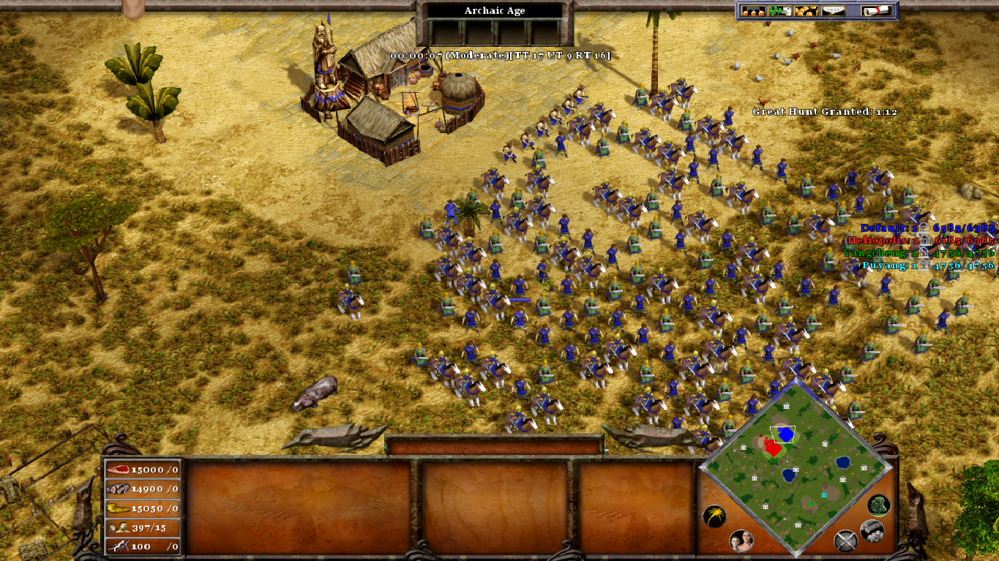

# Adria's Random Maps

This mod is just a collection of random maps extracted from the Mod "Lost Continent of Adria", for those who dont want to intall the mod's Campaign. 

> 

## How to Install

Just place all the files in the Age of Mythology installation folder. For steam installations, the path is usually "C:\Program Files (x86)\Steam\steamapps\common\Age of Mythology".

To uninstall, just execute the script "AdriaRandomMaps.uninstall.bat" (take care, cannot be undone).

## Random Maps

This mod includes the same random maps from the mod "Lost Continent of Adria":

* **Arabian Desert**: A large desert with hidden treasures and bandit camps and scarce wood.
> 

* **Elysius Camps**: A miraculous and brilliant land, with plenty of resources available, but you will have to fight for it.
> 

* **Guardians' Valley**: Each player starts with a Guardian in the Valley of the Kings.
> 

* **Guardians' Megalopolis**: Each player starts with a Guardian in a Savanna megalopolis.
> 

* **One Settlement**: All players start with one settlement and some small villages. But there are no other settlements available.
> 

* **Ragnarock**: A Battle Royale among the gods in a nordic apocalyptic World.
> 

* **Sahara Desert**: All resources are hard to be found on this map, especially wood.
> 

* **Starting Army**: Each player starts with a huge army.
> 

